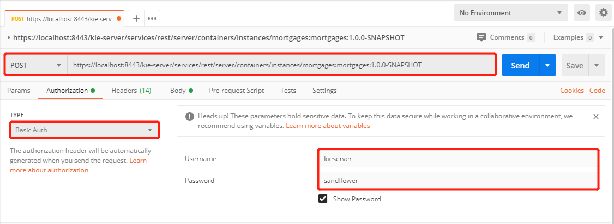
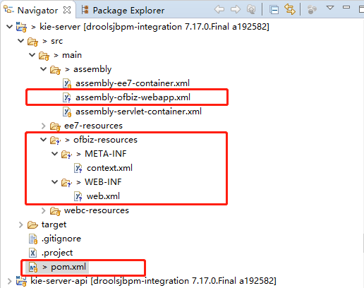
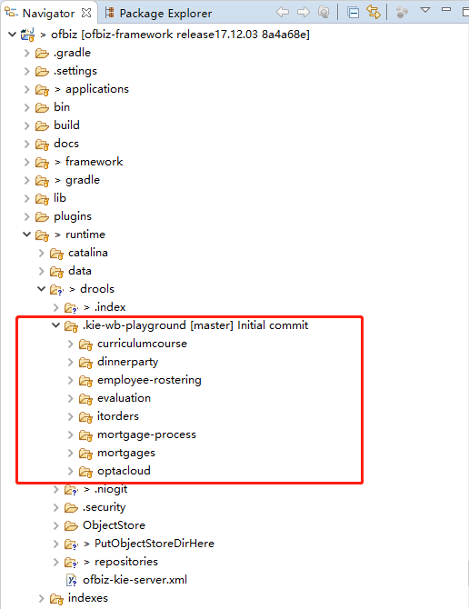
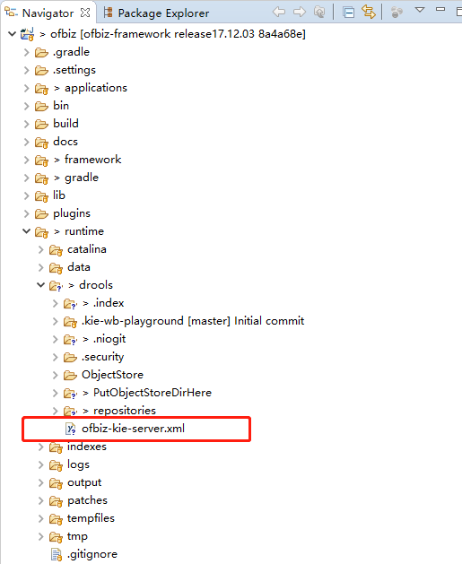
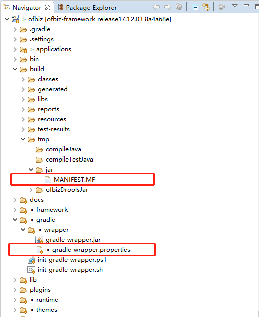

[English](../README.md) | [中文](README_ZH.md)

# OFBiz Drools Plugin

OFBiz Drools插件把[kie drools工作台](https://github.com/kiegroup/kie-wb-distributions)和[kie服务器](https://github.com/kiegroup/droolsjbpm-integration)集成进了[OFBiz](https://github.com/apache/ofbiz)。

本插件是为[SandFlower项目](https://github.com/SandFlower/)开发的，目的是让项目能让小型商业最终用户有一个开箱即用的IOT/RFID产品，以帮助他们设计/测试/部署阶梯价格、阶梯佣金或排班等。

简言之，本插件是一个规则计算器。

<br/>

### 版权
本插件试用Apache License V2.0版权，你可以免费试用

<br/>

### 贡献
欢迎对本插件做任何贡献。

<br/>

### 快速使用

**1. 从https://github.com/apache/ofbiz-framework检出OFBiz 17.12.03**

<br/>

**2. 把patches/ofbiz目录下的补丁文件打到OFBiz中**

<br/>

**3. 下载本插件**

<br/>

**4. 把本插件部署到hot-deploy/drools/目录下**

<br/>

**5. 下载和安装gradle 5.6。如果你使用gradlew命令，请编辑gradle/wrapper/gradle-wrapper.properties文件，修改为使用gradle 5.6:**

```
distributionUrl=https\://services.gradle.org/distributions/gradle-5.6-bin.zip
```

<br/>

**6. 通过下面的命令来安装OFBiz种子数据:**

```
gradle loadAll
```

<br/>

**7. 通过下面的命令启动OFBiz:**

```
gradle ofbiz
```

<br/>

**8. 在浏览器中，访问http://localhost:8080/kie-server/services/rest/server**

用户名: kieserver

密码: sandflower

登录成功后，你可以看到如下图所示的Kie Server信息。


<br/>

**9. 在浏览器中，访问https://localhost:8443/kie-wb/**

用户名: admin

密码: ofbiz

登录成功后，即可使用Kie工作台了。

<br/>

**10. 在Design中，导入一个例子，比如Mortgages，并部署(Deploy)它。**

<br/>

**11. 在Deploy中，添加一个名为runtime/drools/ofbiz-kie-server的kie-server:**


<br/>

**12. 要验证是否有规则计算器在运行，可以访问http://localhost:8080/kie-server/services/rest/server/containers:**


如果要查看一个指定的规则计算器状态，例如mortgages:mortgages:1.0.0-SNAPSHOT，可以访问http://localhost:8080/kie-server/services/rest/server/containers/mortgages:mortgages:1.0.0-SNAPSHOT:


<br/>

**13. 在Postman中调用kie-server规则计算器的规则:**

13.1. 把Auth设置为Basic Auth，用户名: kieserver，密码: sandflower



<br/>

13.2. 把Headers设置为Content-Type: application/json，X-KIE-ContentType: JSON，Accept: application/json


<br/>

13.3. 设置Post请求的Body:


<br/>

13.4. 发送Post请求，得到规则计算的结果


<br/>

### 开发笔记

**1. 如何生成本插件的webapp/business-central-7.17.0.Final下的那些文件**

1.1. 把kie/business-central-distribution-wars-7.17.0.Final.patch补丁打到[kie-wb-distributions/business-central-parent/business-central-distribution-wars/](https://github.com/kiegroup/kie-wb-distributions/tree/7.17.0.Final/business-central-parent/business-central-distribution-wars)项目代码中


<br/>

1.2. 执行mvn clean package命令来生成target/business-central-7.17.0.Final-ofbiz，这个目录就是本插件的webapp/business-central-7.17.0.Final


<br/>

**2. 如何生成本插件webapp/kie-server-7.17.0.Final下的那些文件**

2.1. 把kie/kie-server-7.17.0.Final.patch补丁打到[droolsjbpm-integration/kie-server-parent/kie-server-wars/kie-server/](https://github.com/kiegroup/droolsjbpm-integration/tree/7.17.0.Final/kie-server-parent/kie-server-wars/kie-server)



<br/>

2.2. 执行mvn clean package命令来生成target/kie-server-7.17.0.Final-ofbiz，这个目录就是本插件的webapp/kie-server-7.17.0.Final


<br/>

**3. 为什么要打patches/ofbiz/startup-with-webapp-context.xml.patch补丁**

如你所知，当把kie-drools-wb或kie-server部署到Tomcat下时，META-INF/context.xml会生效。在OFBiz 17.12.03，它没有生效。通过打 patches/ofbiz/startup-with-webapp-context.xml.patch补丁，META-INF/context.xml才会生效，然后认证和JSP标签才能起作用:

```java
         StandardContext context = new StandardContext();
+        String location = getWebappRootLocation(appInfo);
+
+        String contextXmlFilePath = new StringBuilder().append("file:///").append(location).append("/").append(Constants.ApplicationContextXml).toString();
+        URL contextXmlUrl = null;
+        try {
+            contextXmlUrl = FlexibleLocation.resolveLocation(contextXmlFilePath);
+            contextXmlFilePath = new StringBuilder().append(location).append("/").append(Constants.ApplicationContextXml).toString();
+            File contextXmlFile = FileUtil.getFile(contextXmlFilePath);
+            if(contextXmlFile.exists() && contextXmlFile.isFile()) { 
+                Debug.logInfo(contextXmlFilePath + " found and will be loaded.", module);
+                context.setConfigFile(contextXmlUrl);
+            } else {
+                // Debug.logInfo(contextXmlFilePath + " not found or not a file.", module);
+            }
+        } catch (MalformedURLException e) {
+            Debug.logInfo(contextXmlFilePath+ " not found.", module);
+        }
+
         Tomcat.initWebappDefaults(context);
 
-        String location = getWebappRootLocation(appInfo);
```

context.setConfigFile(contextXmlUrl)是其中的核心语句。

<br/>

**4. 为什么要打patches/ofbiz/build.gradle.patch补丁**

在这个补丁中，把rootProject.jvmArguments暴露出来，让插件能够扩展和修改:

```groovy
-List jvmArguments = ['-Xms128M', '-Xmx1024M']
+ext.jvmArguments = ['-Xms128M', '-Xmx1024M']
```

在OFBiz-Drools插件的build.gradle中， rootProject.jvmArguments被扩展了:

```groovy
rootProject.jvmArguments.each { jvmArg ->
    if (jvmArg && jvmArg.startsWith("-Dlog4j.configurationFile=")) {
        originalLog4jConfig = jvmArg
        if (!jvmArg.endsWith("=")) {
            jvmArg += ","
        }
        log4jConfig = jvmArg + "log4j2-drools.xml"
        findLogArg = true
        return true
    }
}
if (!findLogArg) {
    rootProject.jvmArguments.add('-Dlog4j.configurationFile=log4j2.xml,log4j2-drools.xml')
} else {
    rootProject.jvmArguments.remove(originalLog4jConfig)
    rootProject.jvmArguments.add(log4jConfig)
}

...
rootProject.jvmArguments.add('-Dorg.uberfire.nio.git.dir=runtime/drools')
...
```

<br/>

**5. 为什么打patches/ofbiz/cookie-name-slash.patch补丁**

一个测试用例是给ofbiz-component.xml中的/kie-wb和/kie-server加前缀，如:

```
        mount-point="/sandflower/demo/trunk/kie-server"
```

这个patches/ofbiz/cookie-name-slash.patch补丁是解决自动登录cookie在浏览器中报格式错误问题的:

```java
     protected static String getAutoLoginCookieName(HttpServletRequest request) {
-        return UtilHttp.getApplicationName(request) + ".autoUserLoginId";
+        return UtilHttp.getApplicationName(request).replaceAll("/", ".") + ".autoUserLoginId";
     }
```

<br/>

**6. 为什么打patches/kie/kie-wb-common-examples-screen-backend-7.17.0.Final.patch补丁**

这个补丁用于[kie-wb-common-examples-screen-backend](https://github.com/kiegroup/kie-wb-common/tree/7.17.0.Final/kie-wb-common-screens/kie-wb-common-examples-screen/kie-wb-common-examples-screen-backend)，添加了一个新的系统属性org.kie.wb.common.examples.dir，它优先于user.dir属性。这是一个不重要的修改，你可以直接使用user.dir。如果使用这个补丁，会生成一个新的kie-wb-common-examples-screen-backend-7.17.0.Final.jar，并把它部署到webapp/business-central-7.17.0.Final/WEB-INF/lib/下。

代码修改是:

```java
-            String userDir = System.getProperty("user.dir");
+            String userDir = System.getProperty("org.kie.wb.common.examples.dir");
+            if (userDir == null) {
+                userDir = System.getProperty("user.dir");
+            }
```

在本插件的build.gradle中，设置了org.kie.wb.common.examples.dir:

```groovy
rootProject.jvmArguments.add('-Dorg.kie.wb.common.examples.dir=runtime/drools')
```

当运行OFBiz时，kie的样例会部署到runtime/drools/.kie-wb-playground/目录下:



<br/>

**7. 为什么打patches/kie/kie-server-services-common-7.17.0.Final.patch补丁**

本查件把缺省的kie服务器ID设置成了runtime/drools/ofbiz-kie-server:

```groovy
rootProject.jvmArguments.add('-Dorg.kie.server.id=runtime/drools/ofbiz-kie-server')
```

我们期望ofbiz-kie-server.xml在第一次启动时，能在runtime/drools/下自动生成，以后启动时，能从这个文件加载配置:



并且，ofbiz-kie-server应该是Kie服务器ID，这样才能在Drools工作台中控制它:


上面这个场景就是创建这个补丁的原因。

按照[Tomcat document](https://tomcat.apache.org/tomcat-9.0-doc/class-loader-howto.html)文档，有两个类加载方式:

```text
Therefore, from the perspective of a web application, class or resource loading looks in the following repositories, in this order:

Bootstrap classes of your JVM
/WEB-INF/classes of your web application
/WEB-INF/lib/*.jar of your web application
System class loader classes (described above)
Common class loader classes (described above)

If the web application class loader is configured with <Loader delegate="true"/> then the order becomes:

Bootstrap classes of your JVM
System class loader classes (described above)
Common class loader classes (described above)
/WEB-INF/classes of your web application
/WEB-INF/lib/*.jar of your web application
```

如果你的OFBiz是加载类型一，不需要使用这个补丁，因为src/main/java/org/kie/server/services/impl/controller/DefaultRestControllerImpl.java编译后会被部署到/WEB-INF/classes，这个类会生效。

如果你的OFBiz是加载类型二，这也是我下载的OFBiz 17.12.03的类型，这个补丁打到[droolsjbpm-integration/kie-server-parent/kie-server-services/kie-server-services-common](https://github.com/kiegroup/droolsjbpm-integration/tree/7.17.0.Final/kie-server-parent/kie-server-services/kie-server-services-common)。lib/kie-server-services-common-7.17.0.Final.jar是打了这个补丁的jar，直接使用即可。

<br/>

**8. 为什么使用Gradle 5.6**

gradle/wrapper/gradle-wrapper.properties中的Gradle版本是3.2.1，它无法正确生成ofbiz.jar中的MANIFEST.MF的Class-Path，在这里，主要是不能正确解决Lucene版本。我们知道，OFBiz启动时，使用这个Class-Path作为classpath。我偶然把3.2.1改成了5.6，就可以了。我猜很多比3.2.1高的版本都可以，但是我没有试。



<br/>

**9. 为什么lib/juel-impl-no-osgi-2.2.7.jar**

OFBiz build.gradle中包含了juel-impl-2.2.7.jar:

```groovy
    compile 'de.odysseus.juel:juel-impl:2.2.7'
```

这个jar包含了一个OSGI-INFO/services.xml，xml的内容是:

```xml
<?xml version="1.0" encoding="UTF-8"?>
<root xmlns:scr="http://www.osgi.org/xmlns/scr/v1.1.0">
    <scr:component name="de.odysseus.el.ExpressionFactoryImpl">
        <implementation class="de.odysseus.el.ExpressionFactoryImpl"/>
        <service>
            <provide interface="javax.el.ExpressionFactory"/>
        </service>
    </scr:component>
</root>
```

这个OSGI配置导致了本插件JSP文件中的EL表达式出错，所以我把juel-impl-2.2.7.jar解压（unzip）后，删除OSGI-INFO，再重新打包（zip），把新的jar文件命名为juel-impl-no-osgi-2.2.7.jar，并放在了lib目录下。然后，JSP文件就正常了。

<br/>

**10. 为什么选择kie 7.17.0.Final**

有以下两个原因：

第一个原因是cdi-api 1.x。Kie 7.20.0.Final是最后一个支持cdi-api 1.x的版本。更新的版本，都要求支持cdi-api 2.0。在我做的测试中，在Tomcat 9.0.x下，cdi-api 2.0还无法运行。我找到了这篇文档[Tomcat cdi document](https://tomcat.apache.org/tomcat-9.0-doc/cdi.html)，我猜想要到Tomcat 9.5.x或更晚的版本，才会支持cdi-api 2.0。

第二个原因是Kie 7.17.0.Final是最新的既支持cdi-api 1.x，又能够正确构建lucene索引，并在重启后继续使用这些索引的。其它版本会报锁错误：**org.apache.lucene.store.LockObtainFailedException: Lock held by this virtual machine**

<br/>

**11. 别忘记匹配ofbiz-plugins中的Lucene版本**

[OFBiz Lucene plugin 17.12.03](https://github.com/apache/ofbiz-plugins/blob/release17.12.03/lucene/build.gradle)中的Lucene版本是7.1.0，比Kie中的版本新。我修改了src/main/java/org/uberfire/ext/下的几个文件，来匹配这个版本变化，并使用Elasticsearch 6.1.1。

<br/>

感谢你阅读本文档。

--- 本文档结束 ---